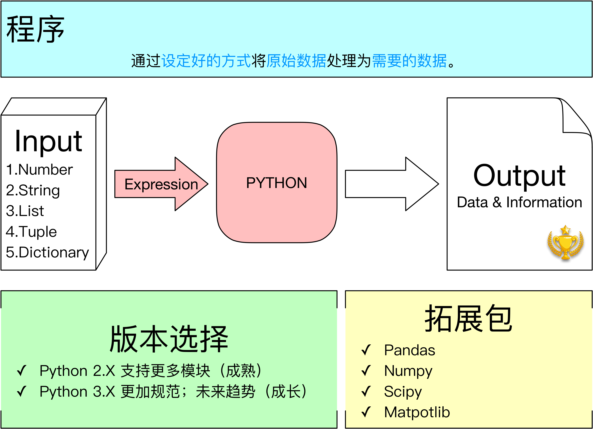

# Python 学习笔记

## 0.认识 Python

Python 是一种程序语言。我们主要利用 Python 进行金融数据分析，也即将所谓的“Raw Data”（例如股票价格等）转化为“Cooked Data”。为了达成这一目的，我们主要需要掌握 Python **网络爬虫**、**数据分析**、**数据库管理**这三个方向。由此，除了 Python 编程的基础知识以外，我们还需要学习以下拓展知识：

**网络爬虫**

- Urllib 拓展包：用于抓取网页内容
- 正则表达式：用于进行数据清洗

**数据分析**

- Pandas
- Numpy
- Scipy
- Matpotlib

**数据库管理**

- MySQL 数据库搭建与运维

说明:
Python 是一门面向对象语言。对象具有三个特性：`身份`（对象的唯一标识符）、`类型`、`值`（对象的赋值）。
Python 对象的标准类型为**数字**、**字符串**、**列表**、**元组**以及**字典**。

## 1.变量类型：数字

Integer|Boolean|Long Integer|Float|Complex Number
---|---|---|---|---
整型|布尔型|长整型|浮点型|复数型

## 2.变量类型：序列——字符串、列表、元组

## 3.变量类型：字典

## 4.操作符——作用与变量
**算数操作符**被用来处理**数字变量**。

+|-|\*|/|%|\**|//
---|---|---|---|---|---|---
加|减|乘|除|求余|乘方|地板除

笔记:
这里有一个小技巧——`a += 2` 等同于 `a = a + 2`；`b -= 5` 等同于 `b = b -5`；`c *= 7` 等同于 `c = c * 7`；`d /= 9` 等同于 `d = d / 9`。当进行迭代运算时，这个技巧有利于降低代码的复杂度。

****

**比较操作符**被用来比较变量的值并**返回一个布尔值**。

<|<=|>|>=|==|!=
---|---|---|---|---|---
大于|大于等于|小于|小于等于|等于|不等于

****

**逻辑运算符**被用来处理逻辑条件并**返回一个布尔值**。

or|and|not
---|---|---
或|与|非

## 5.条件分支与循环——程序基本框架

**条件语句**分别使用 `if`、`elif`、`else` 三个关键字来定义**条件**、**备选条件**、**其他**。

笔记:
利用**三元操作符**可以将代码简化。例如：`variable = x if x < y else y`，一条语句即可完成多个条件判断。另外，因为 `else` 定义了“其他”，因此不可以对其定义条件。

这里还有一个特殊的条件关键——`assert`，其作用是一旦满足其规定的条件，程序立即终止。这一关键字被用来处理异常值，以避免错误的变量被应用于后续计算。例如一个 `assert x = 0` 条件句可以用来终止后续 `1 / x` 的运算。

注意:
`assert` 是一个**关键字**而非函数。因此使用时不要在后面加括号。

****

Python 提供两种循环模式：**计数器循环** `for` 语句和 **一般循环** `while` 语句。当进行 `for` 循环时，若目标 `in` 表达式 `:`，则会进行循环；范例为 `for i in range(20)`。因为 `for` 循环的目标是可以迭代的并且 Python 会自动捕获目标状态，因此当目标离开定义范围后，`for` 循环会结束。 `while` 的条件一旦达成，则会无限次执行 `while` 代码块内的代码，范例为 `while x < 10:`。**终止循环**：为了避免代码形成死循环，需要为循环设立出口，因此，可以在条件满足时用 `break` 语句来终止 `while` 循环。**终止本轮循环并开始下一轮循环**：`continue` 可以配合 `if` 语句打断一个循环，即不执行后面的代码，并重新判断是否执行循环。

## 6.函数

****
递归

****

当需要使用一个只会用到一、两次的自定义函数时，用 `def` 函数来进行定义会显得很麻烦。这时就体现出创建 `lambda` 函数式的优势——**方便**。以下是一个范例：`function = lambda x: x ** 3`。在 `lambda` 与 `:` 之间的就是 `lambda` 调用的元素；而在 `:` 之后则是这个函数的解析式。与定义函数的方法相同，`lambda` 也**可以调用多个元素**，例如 `function = lambda x, y: x + y`。在范例中，`lambda` 生成了一个 `function()` 函数，当不再这个函数使用时，Python 会自动将这个函数占用的内存回收（**而不是像 `def` 定义的函数一样始终占用内存**）。

注意:
`lambda` 不使用`()` 来定义参数和函数解析式。这一点和 `def` 采用的 `def function(x):` 的形式很不一样。

说明:
在范例中，将 `lambda x: x ** 3` 作为变量 `function` 的赋值，在实际应用中，进行这种定义是非必要的。因为 `lambda` 可以搭配 `filter()` 函数和 `map()` 函数使用。`filter()` 和 `map()` 的参数形式都为 `条件式, 范围`。

- `filter()` **筛选**范例：`y = list(filter(lambda x: x % 2 == 0, range(10)))` 生成一个 0 到 9 范围内的偶数列表。
- `map()` **遍历**范例：`y = list(map(lambda x, y: x + y, range(10))), range(10,20)` 让 0 到 9 分别与 10 到 19 相加并生成列表。

## 7.文件

当利用 Python 处理数据时，可以把**文件**视为一个“**容器**”：它既可以储存待处理的数据，又可以储存处理好的数据。对文件的操作包括两个部分：（一）**打开文件**；（二）**对已开的文件进行操作**。

****

**打开文件**的方法很简单，直接对变量赋值一个 `open()` 函数即可，范例 `file = open('file path', option)`。可以使用的参数包括以下：

r|w|a|x|b|t|+
---|---|---|---|---|---|---
读取（默认选项）|创建／覆写|续写|当文件名存在立即报错|二进制方式打开|文本方式打开|追加到其他参数后，读写

**对已打开的文件进行操作**，包括**读取**与**写入**。

****

- `file.tell()`：显示 file 中**指针**所在的位置。
- `file.seek(偏移数, 起点)`：将**指针移动**到从 from 起 offset 个字节的位置。

****
- `file.read(字节数)`：按设置的字节数读取 file。
- `file.readline()`：返回 file 中指针所在的行。

注意:
当需要读取一个较长的文件时，使用 `*.readline()` 效率比较低。推荐的调用方法如下：
	
	for i in file:
		print(i)

****

- `file.write(字符串)`：在结尾写入一个字符串。
- `file.writelines(序列)`：在结尾写入一个序列。

****

`os` 模块为 Python 带来了多平台*文件系统*支持，详见 [`os` 模块中关于**文件**／**路径**常用的函数使用方法](Python学习笔记os.md)；[`os.path` 模块中关于*路径*常用的函数使用方法](Python学习笔记os.path.md)